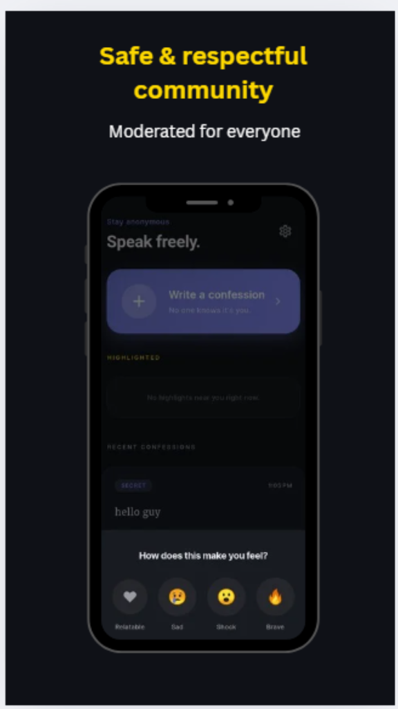
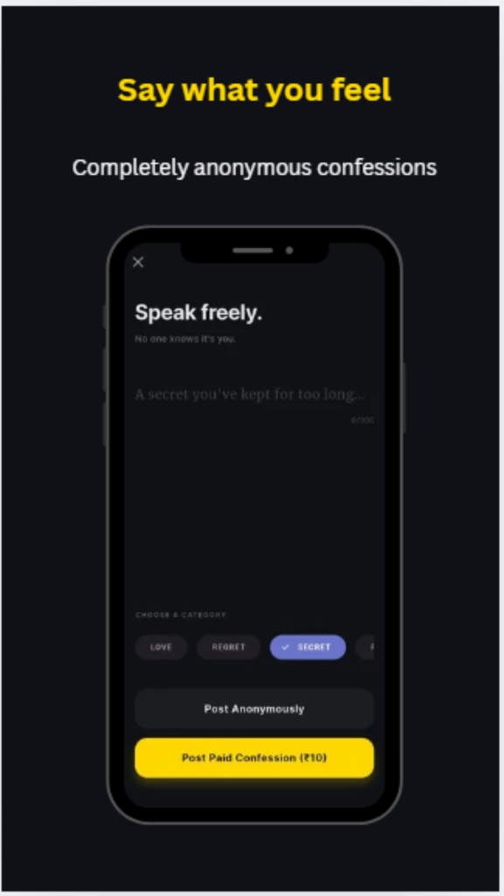
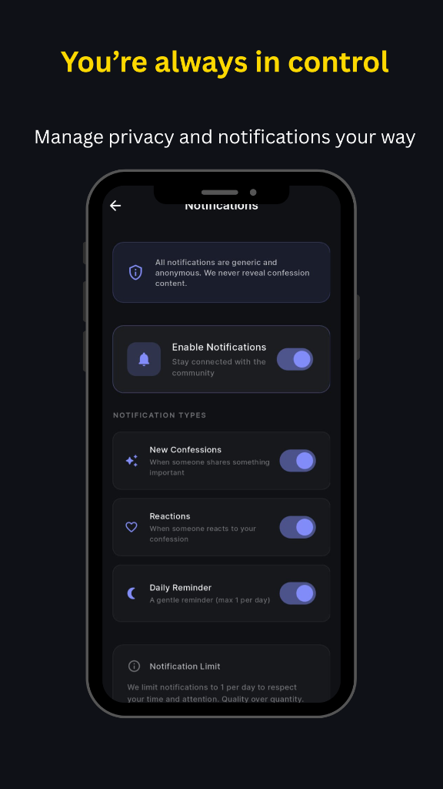
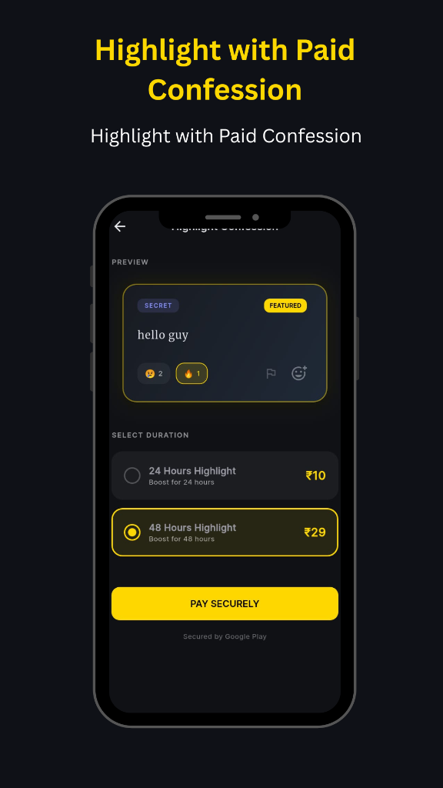

# ConfessMe

ConfessMe is an anonymous confession platform built with Flutter, designed for college students to share thoughts, secrets, and feelings without revealing their identity.

It solves the problem of **fear, judgment, and hesitation** by allowing users to express themselves freely and anonymously.

---

## ✨ Features

- 🕵️ Anonymous Confessions
- 💬 React to Confessions
- ⭐ Paid Highlighted Confessions
- 🔥 Trending Confessions Feed
- 🔐 Privacy-first design
- 📱 Clean & modern UI for students

---

## 🛠 Tech Stack

- **Frontend:** Flutter (Dart)
- **Backend:** Firebase Cloud Functions
- **Database:** Cloud Firestore
- **Auth:** Firebase Authentication
- **Notifications:** Firebase Cloud Messaging

---

## 📸 Screenshots






---

## 🚀 Getting Started

### Prerequisites
- Flutter SDK
- Android Studio or VS Code
- Firebase project

### Setup

```bash
git clone https://github.com/luckkyyy-00/ConfessME.git
cd ConfessME
flutter pub get
flutter run
```

> [!WARNING]
> You must add your own Firebase configuration files:
> - `google-services.json`
> - `GoogleService-Info.plist`

## 📄 License

This project is intended for learning, portfolio, and demonstration purposes.
